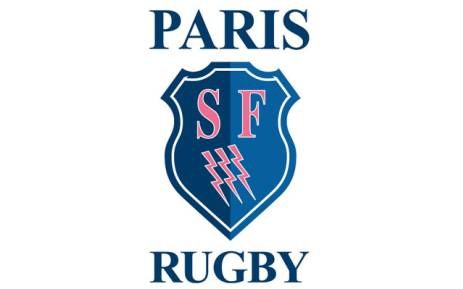

```{r setup, include=FALSE}
knitr::opts_chunk$set(echo = FALSE) #, fig.width=8, fig.height=4.5, dpi=300, out.width="1920px", out.height="1080px")
```

## Solving a problem no one saw


Working freelance for Stade Francis I was able to solve a problem they didn't know they had. Delivering quaity analytics that helped drive insight and critical understanding. 

The communication of this insight represented for me a colmination of my ability to assess critically and deliver thoughtful insight.
<div class="centered">


```{r, out.width = "300px"}

```


</div>


## Quick overview of the presentation
<div class="columns-2">
- Introduction
- Background
- Understanding the problem
- Executing
- Feedback and self evaluation
- Presentation and value added
- Conclusion

```{r, warning=FALSE,echo = FALSE, out.width = "300px", out.height= "350px"}
library(leaflet)
m <- leaflet() %>%
  addTiles() %>%  # Add default OpenStreetMap map tiles
  addMarkers(lng=-0.276, lat=51.152, label="We are here at the Atom Group headquarters")
m  # Print the map


```

</div>
## Introduction

Stade Francis is a Paris rugby team in the Top 14 French competition. My father is a defence coach with a background in the NZ rugby system which is: high achieving, embracing of change and market leading. The French team wants sucess without change and relies on outdated tech do deliver insight and understanding.


## Background

<b>Why is this my greatest Achievement?</b>

- Personal connection
- Culmination of my experience
- Delivering insight achieving results


## Understanding the problem

- Technical/data literacy
- Reasource restrictions
- Bureaucracy and fear of change


## Examples of challenges faced

```{r, out.width = "800px"}
knitr::include_graphics("./Assets/abc.jpg")
```


## Examples of challenges faced

```{r, out.width = "800px"}
knitr::include_graphics("./Assets/3.jpg")
```


## Examples of challenges faced

```{r, out.width = "800px"}
knitr::include_graphics("./Assets/2.jpg")
```


## Execution


<iframe class="chart" src=https://ezekiel.nz/shiny/RugbyAnalytics/players.Rmd" width="800"   height="550" style="border: none;"></iframe>

## Feedback and self evaluation

- Comparing Apples and oranges?
- Poor layout and outdated data
- 

## Presentation and value added


<iframe class="chart" src="https://ezekiel.nz/shiny/Stade/defence.Rmd" width="800"   height="550" style="border: none;"></iframe>

## Conclusion

##
### Why use render markdown?

```{r, warning=FALSE,echo = TRUE, out.width = "800px", out.height= "150px"}

library(leaflet)

m <- leaflet() %>%
  addTiles() %>%  
  addMarkers(lng=-0.276, lat=51.152, label="We are here 
             at the Atom Group headquarters")
m  # Print the map


```

##
### Why use render markdown?

```{r, iris, warning=FALSE, echo = FALSE}

library(dplyr)
library(highcharter)

  m <-highchart() %>%
          hc_xAxis(categories = iris$Species) %>% 
          hc_add_series(name = "Tackles", data = iris$Sepal.Length, type = "column") %>%
          hc_tooltip(sort = TRUE, table = TRUE, valueDecimals = 2, type = "column") %>%
          #hc_colors(cols) %>%
          hc_title(text = "Highcharter Example")
  m  

```


