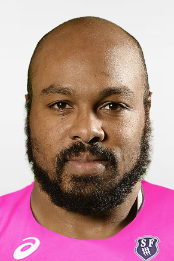

---
title: "Rugby Analytics"
output:
  html_document:
  theme: default
  runtime: shiny
--- 
  
```{r setup, include=FALSE}
####### Required libs

libs <- c("tidyverse", "lubridate", "RODBC", "sqldf", "openxl, rmasx", "sqldf", "httr", "RCurl", "jsonlite", "readxl", "dplyr", "shiny", "rmarkdown", "knitr") #, "stringdist")
lapply(libs, require, character.only = TRUE)

####### 

  
####### Read in data
joinner <- readRDS("playerprofile.rds")


```


<!-- # ```{r, ForAgainst} -->
<!-- # -->
<!-- # plot1 <- ggplot(ForAgainst, aes(x=Team, y=Tries, fill = ForAgainst)) + geom_bar(stat = "identity", position = "stack") -->
<!-- # -->
<!-- # plot1 -->
<!-- # -->
<!-- # ``` -->





```{r, echo=FALSE}


selectInput("player", "Choose Player:",

c(
 "Abdellatif Boutaty"      ,"Aled De Malmanche"       ,"Alexandre Flanquart"     ,"Antoine Burban"          ,"Arthur Coville"         
,"Bakary Meite"            ,"Benjamin Epsinal"        ,"Clement Daguin"          ,"Craig Burden"            ,"Djibril Camara"         
,"Elies El Ansari"         ,"Emmanuel Felsina"        ,"Etienne Swanepoel"       ,"Geoffrey Doumayrou"      ,"George Pisi"            
,"Gerhard Mostert"         ,"Giorgi Melikidze"        ,"Heinke Van der Merwe"    ,"Hugh Pyle"               ,"Hugo Bonneval"          
,"Jean Baptiste De Clercq" ,"Jeremy Sinzelle"         ,"Jimmy Yobo"              ,"Jonathan Danty"          ,"Jonathan Ross"          
,"Josaia Raisuqe"          ,"Jules Plisson"           ,"Julien Arias"            ,"Julien Dupuy"            ,"Karim Qadiri"           
,"Laurent Panis"           ,"Laurent Sempere"         ,"Lorenzo Cittadini"       ,"Mathieu De Giovanni"     ,"Mathieu Ugena"          
,"Meyer Bosman"            ,"Morne Steyn"             ,"Pascal Papé"             ,"Patrick Sio"             ,"Paul Alo-Emile"         
,"Paul Gabrillagues"       ,"Paul Williams"           ,"Rabah Slimani"           ,"Raphael Lakafia"         ,"Ratu Ratini"            
,"Remi Bonfils"            ,"Remi Seneca"             ,"Remy Bonfils"            ,"Romain Martial"          ,"Sakaria Taulafo"        
,"Sekou Macalou"           ,"Sergio Parisse"          ,"Simone Favaro"           ,"Steevy Cerqueira"        ,"Sylvain Nicolas"        
,"Terry Bouhraoua"         ,"Theo Millet"             ,"Tony Ensor"              ,"Waisea Nayacalevu"       ,"Will Genia"             
,"Willem Alberts"          ,"Zurabi Zhvania"         

) 
)     
renderTable({ 
  
  joinner %>% 
  filter(Player ==  input$player) %>%
  select(Total.Mins,"Tackles Made" = Total.Complete,"Tackle Percentage" = PercentageMade,Carries,Metres)
  
  
  
})

renderPlot({ 
  x  <-   joinner %>% 
  #filter(Player ==  "Theo Millet") %>%  
  filter(Player ==  input$player) %>%
  select(Player, Total.Mins,"Tackles Made" = Total.Complete,"Tackle Percentage" = PercentageMade,Carries,Metres)
  
  y <- (joinner %>% summarise("Total.Mins" = mean(Total.Mins), "Tackles Made" = mean(Total.Complete, na.rm = TRUE), "Tackle Percentage" = mean(PercentageMade, na.rm = TRUE),"Carries" = mean(Carries, na.rm = TRUE), "Metres" = mean(Metres, na.rm = TRUE) )) %>% mutate(Player = "Average")


  z <- bind_rows(x, y)
  
  ggplot(z, aes(x = Player, y = `Tackle Percentage`)) + geom_bar(stat = "identity", position = "stack")
  
   
})
```


